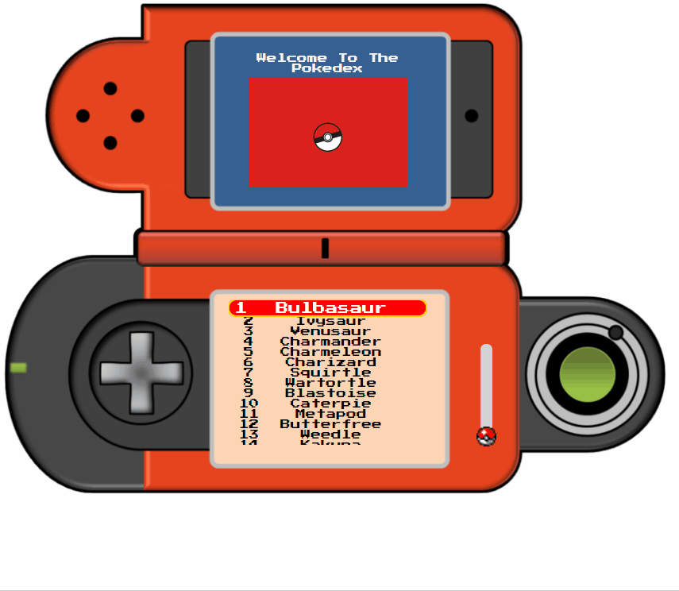

# pokedex

A JavaScript application to simulate a pokedex.

## Technologies Used

- JavaScript
- jQuery
- HTML5
- CSS3

## Live Demo

Try the application live at [https://pokedex.uzairashraf.dev/](https://pokedex.uzairashraf.dev/)

## Instructions

Your arrow keys will let you navigate.
Enter key pull up the selected Pokemon's data.
The pokeball slider will adjust volume of sounds.
The Pokedex buttons are functional as well!

## Features

- User can navigate through pokedex
- User can see pokemons data
- User can use pokedex buttons with the mouse
- User can navigate using arrow keys and enter button

## Preview

